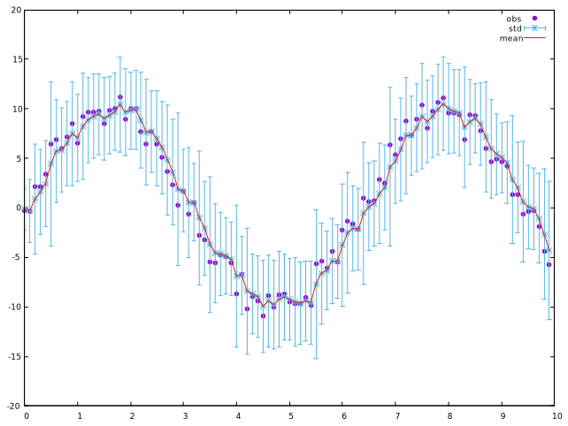

# JAX Based Parallel Inference for Reactive Probabilistic Programming: Artifact

This artifact supports the LCTES 2022 article **JAX Based Parallel Inference for Reactive Probabilistic Programming**. It contains:

- `zelus`: a modified version of the [Zelus](https://zelus.di.ens.fr) compiler with a new JAX backend
- `probzelus`: the original [ProbZelus](https://github.com/IBM/probzelus) runtime for OCaml
- `zlax`: the new ProbZelus runtime for JAX
- `examples`: several examples of ProbZelus programs
- `zlax-benchmarks`: the benchmarks to compare the OCaml and JAX runtimes based on the original [ProbZelus benchmark](https://github.com/IBM/probzelus)
- `lctes22-zlax.pdf`: the [LCTES 2022](https://pldi22.sigplan.org/track/LCTES-2022) paper.
- `lctes22-zlax-image.tar.gz`: the saved [Docker](https://www.docker.com) image with everything installed.


## Relationship with the paper

The `coin` example presented in Section 2 is provided in the file `examples/coin.zls` and the tracker example presented Section 3 is in the file `examples/hmm.zls`.

All the JAX support for Zelus and ProbZelus is new and defined in the `zlax` directory. In particular, the node `zmap` (called `vmap` in the code) presented in Section 3 is defined in `zlax/zlax/zlax/jax.py` and the inference engines are defined in `zlax/probzlax/probzlax/infer_importance.py` and `zlax/probzlax/probzlax/infer_pf.py`.

The Zelus to Python compiler via muF presented in Section 4 is an extension of the [Zelus](https://github.com/INRIA/zelus) open source compiler. The complete compiler is provided in the `zelus` directory. The new addition to the compiler is mostly defined in `zelus/compiler/muf`.

Finally, the benchmarks used for the evaluation in Section 5 are provided in the `zlax-benchmarks` directory. To reproduce the performance results, you need to have access to a GPU and install the artifact from sources.

## Getting Started Guide

The easiest way to run the artifact is to use [Docker](https://www.docker.com). It has been tried with Docker Desktop 4.7.1 (engine: 20.10.14).

The following command loads the saved Docker image `lctes22-zlax-image.tar.gz`:

```
docker load --input lctes22-zlax-image.tar.gz
```

Then you can launch a shell in the container where ProbZelus is installed as follows:

```
docker run -ti --rm lctes22-zlax bash
```

In this shell, you can compile and execute an example with:

```
make test
```

This command compiles the program `examples/coin.zls` to produce the file `examples/coin.py` which is then executed for 20 time steps. It produces the following output:

```
zluciole -prob -n 20 -s main coin.zls
WARNING:absl:No GPU/TPU found, falling back to CPU. (Set TF_CPP_MIN_LOG_LEVEL=0 and rerun for more info.)
(('cheater', False), ('mean', 0.6717269420623779), ('std', 0.11130373924970627))
(('cheater', False), ('mean', 0.7557700872421265), ('std', 0.06814471632242203))
(('cheater', False), ('mean', 0.8101494908332825), ('std', 0.041515689343214035))
(('cheater', False), ('mean', 0.8406216502189636), ('std', 0.029811734333634377))
(('cheater', False), ('mean', 0.8691132664680481), ('std', 0.019973836839199066))
(('cheater', False), ('mean', 0.8866547346115112), ('std', 0.014147775247693062))
(('cheater', False), ('mean', 0.8979822397232056), ('std', 0.010037769563496113))
(('cheater', False), ('mean', 0.9038761854171753), ('std', 0.00862805638462305))
(('cheater', True), ('mean', 0.9117443561553955), ('std', 0.0070923734456300735))
(('cheater', True), ('mean', 0.9166853427886963), ('std', 0.005953306797891855))
(('cheater', True), ('mean', 0.9246258735656738), ('std', 0.004949973430484533))
(('cheater', True), ('mean', 0.9284363389015198), ('std', 0.004679297562688589))
(('cheater', True), ('mean', 0.9336134195327759), ('std', 0.003929308149963617))
(('cheater', True), ('mean', 0.9360647201538086), ('std', 0.003770894603803754))
(('cheater', True), ('mean', 0.936414361000061), ('std', 0.0036349124275147915))
(('cheater', True), ('mean', 0.9377480745315552), ('std', 0.003548545530065894))
(('cheater', True), ('mean', 0.9395267963409424), ('std', 0.0033768112771213055))
(('cheater', True), ('mean', 0.9412149786949158), ('std', 0.0032705666963011026))
(('cheater', True), ('mean', 0.9443446397781372), ('std', 0.003037207294255495))
(('cheater', True), ('mean', 0.9484158754348755), ('std', 0.0025094265583902597))
```

The `WARNING` confirms the use of JAX.
CUDA is not installed in the Docker image, JAX executes the program on CPU.

_Remark._ The instructions to install the artifact with a version of JAX compatible with GPUs are provided below.


You can also run a scaled down version of the benchmark by running the command:

```
make test_bench
```

This command compiles all the benchmarks, run them 3 times with the number of particles ranging from 100 to 500, analyze the results, and produces the graphs. WARNING: the execution is slow (about 20 minutes on our computer) and the performances results do not match the paper because the benchmarks are executed without GPUs.

To open the generated results you can first copy them outside of the container by executing the following command in a terminal outside of the container and then open the `png` files in the `plot` directory:

```
docker cp $CONTAINER:/home/opam/lctes22-zlax/zlax-benchmarks/plot .
```

where `$CONTAINER` should be replace by the container name that can be obtain with the command `docker ps`.


## Step by Step Instructions

The following instructions are assuming that you are executing a terminal in the Docker container as explain above.

The `zluciole` tool compiles a ProbZelus program in Python/JAX and drives its execution.
For example, the  file `examples/counter.zls` contains a node that implements a counter.

```
let node main () = o where
    rec o = 0 -> (pre o + 1)
```

The `zluciole` tool takes as argument the number of time steps to execute (`-n` option), the node to execute (`-s` option), and the name of the file.
The node to execute must have type `unit -> 'a` and can only call pure functions (functions with side effects cannot be compiled into JAX).
`zluciole` prints on the standard output the output of the program one line per instant.

```
$ zluciole -n 10 -s main examples/counter.zls
WARNING:absl:No GPU/TPU found, falling back to CPU. (Set TF_CPP_MIN_LOG_LEVEL=0 and rerun for more info.)
0
1
2
3
4
5
6
7
8
9
```

The `examples` directory contains the examples presented in Sections 2 and 3.
The `Makefile` in this directory can be used to execute these examples.

```
$ cd examples
$ make
Usage:
  make coin     #  simulate the coin example
  make hmm      #  simulate the hmm example
  make hmm-plot #  simulate the hmm example with graphical interface using gnuplot
  make hmm-plot-ascii	#  simulate the hmm example with ascii graphical interface using gnuplot
  make clean    #  cleanup
```

### Example 1: `coin`

The `coin.zls` program raises an alarm when we can be reasonably sure that an observed coin is too biased. In this example, we assume that the observations are always `true`/head (the input of the `cheater_detector` node is the constant `true` in the main node).

```
node watch x = alarm where
  rec automaton
  | Wait -> do alarm = false until x then Ring
  | Ring -> do alarm = true done

proba coin obs = theta where
    rec init theta = sample (uniform_float (0.0, 1.0))
    and () = observe (bernoulli theta, obs)

node cheater_detector x = cheater, (m, s) where
  rec theta_dist = infer 1000 coin x
  and m, s = stats_float theta_dist
  and cheater = watch ((m < 0.2 || 0.8 < m) && (s < 0.01))

node main () = ("cheater", cheater), ("mean", m), ("std", s) where
    rec cheater, (m, s) = cheater_detector true
```

To execute a probabilistic program, we must pass the `-prob` option to `zluciole`.
For instance, the following command executes the `coin` example (cf. `make coin`):

```
$ zluciole -prob -n 10 -s main coin.zls
(('cheater', False), ('mean', 0.6717270016670227), ('std', 0.11130374670028687))
(('cheater', False), ('mean', 0.7557703256607056), ('std', 0.06814475357532501))
(('cheater', False), ('mean', 0.810149610042572), ('std', 0.04151570796966553))
(('cheater', False), ('mean', 0.8406215906143188), ('std', 0.02981172874569893))
(('cheater', False), ('mean', 0.8691133260726929), ('std', 0.019973836839199066))
(('cheater', False), ('mean', 0.8866546154022217), ('std', 0.014147769659757614))
(('cheater', False), ('mean', 0.8979821801185608), ('std', 0.010037768632173538))
(('cheater', False), ('mean', 0.9038760662078857), ('std', 0.008628054521977901))
(('cheater', True), ('mean', 0.9117444157600403), ('std', 0.007092374376952648))
(('cheater', True), ('mean', 0.9166853427886963), ('std', 0.00595330772921443))
```

After 9 time steps, the condition `(m < 0.2 || 0.8 < m) && (s < 0.01)` on the mean `m` and standard deviation `s` of the bias distribution becomes true and the alarm `cheater` is raised.


### Example 2: `HMM`

The `hmm.zls` program implements a simple 1D position tracker.
At each time step, we assume that the current position follows a normal distribution around the previous position, and the current observation follows a normal distribution around the current position.

```
proba hmm  obs = x where
  rec x = sample (gaussian (0.0 -> pre x, speed))
  and () = observe (gaussian (x, noise), obs)

node main () = t, obs, m, s where
  rec t = 0. fby (t +. 0.1)
  and obs = 10.0 *. sin(t) +. (draw (gaussian (0.0, 1.0)))
  and x_dist = infer 1000 hmm obs
  and m, s = stats_float x_dist
```

As for the previous model, we can launch this program with the following command to obtain at each instant, the current date `t` (incremented by 0.1 at each instant), the current observation `obs`, and the mean `m` and standard deviation `s` of the estimated position `x_dist` (cf .`make hmm`):


```
$ zluciole -prob -n 10 -s main hmm.zls
(0.0, -0.6177732944488525, -0.21219289302825928, 2.1207327842712402)
(0.10000000149011612, 1.695770025253296, 0.6171027421951294, 4.265596866607666)
(0.20000000298023224, 1.8255577087402344, 1.1918796300888062, 4.415806293487549)
(0.30000001192092896, 0.6059656143188477, 0.9084848165512085, 4.367940902709961)
(0.4000000059604645, 4.3959431648254395, 2.6987271308898926, 7.60023832321167)
(0.5, 3.355968475341797, 3.0306355953216553, 4.389452934265137)
(0.6000000238418579, 4.826956748962402, 3.942495822906494, 4.642572402954102)
(0.7000000476837158, 7.527453899383545, 5.652518272399902, 6.94222354888916)
(0.8000000715255737, 6.175825119018555, 5.990218639373779, 4.096563816070557)
(0.9000000953674316, 6.605088710784912, 6.298244953155518, 3.929673194885254)
```

We can redirect this output to gnuplot to visualize the results (cf. `make hmm-plot` or `make hmm-plot-ascii` in the Docker container).



### Benchmarks

The directory `zlax-benchmarks` contains the benchmarks used in Section 5 (Evaluation).

WARNING: you need a CUDA powered JAX installation to test the benchmarks on GPUs.
In the paper we used Python 3.9 and CUDA 11.1.
You can install the JAX version used for the benchmarks with:

```
make install_zlax_cuda
```

To reproduce the benchmarks you have to execute the following commands.

```
$ cd zlax-benchmarks    #  go to the benchmarks directory
$ make zlax_build       #  build all the examples
$ make zlax_bench       #  run the experiments and produce the data in csv file in each sub-directories
$ make zlax_analyze     #  analyze the csv files to produce some summary for zlax experiments
$ make zlax_plot        #  generate the graphs in `plot/*.png`
```

WARNING: the execution might take several days.  

The scale of the experiments can be configured with makefile variables. For example the experiments can be launched for 1000 to 5000 particles with only 3 runs per number of particles as follows:

```
$ make NUMRUNS=3 MIN=1000 MAX=5000 zlax_bench
```

The same command can be executed in any sub-directory to run only the selected example.

## Installation from sources

The prerequisites for installing the artifact are:
- [opam](http://opam.ocaml.org/) with OCaml version 4.13.1
- [pip](https://pypi.org/project/pip/) with Python version 3.9
- [JAX](https://github.com/google/jax) version 0.2.25 (see https://github.com/google/jax#installation for installation with GPUs)

The following commands installs the ProbZelus compiler and the `zlax` Python package and tests the installation:

```
$ make init
$ probzeluc -version
$ zluciole --help
```

The Docker image can be recreated as follows:

```
docker build -t lctes22-zlax -f lctes22-zlax.docker .
```
## Integration with Python

Our compiler produces valid Python code that can be embedded in an arbitrary Python script. 
For instance, the file `counter.zls` is compiled into `counter.py` which contains a declaration for each node, e.g., `main`.

```
zeluc -jax counter.zls
```

Then in a Python script, we can execute 10 steps of node main with:

```python
from zlax.muflib import init, step
from counter import main # import the compiled node

s = init(main) # create initial state

for i in range(10):
  s, o = step(s, ())  # execute one step with input `()`
  print(o)            # print output
```